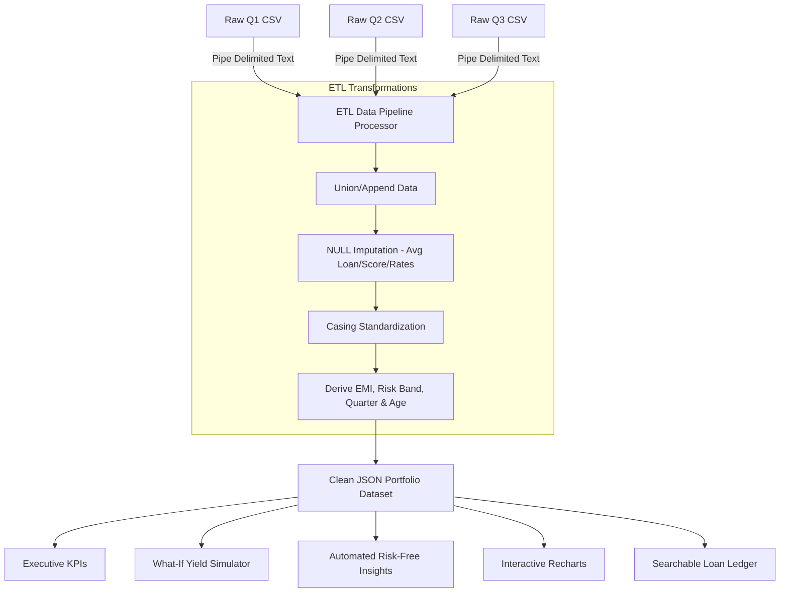

# RiskGuard Analytics | Credit & Portfolio Risk Intelligence

RiskGuard Analytics is an end-to-end, high-performance finance risk analytics platform. It bridges the gap between raw, dirty transaction records and automated credit decision-making. 

This project showcases two implementation paths:
1. **Power BI Dashboard:** A star-schema BI model powered by Power Query (M Language) and DAX.
2. **React Web Dashboard:** A modern, tactile, light/dark responsive dashboard with a live ETL compiler, What-If simulator, and automated portfolio optimization.

---

## 🚀 Key Achievements & Core Insights

- **Portfolio Quality:** Bad Loan Rate of **37.5%**, significantly exceeding the conservative banking benchmark of **20%**.
- **Portfolio Value:** Total disbursed loan capital of **₹7.90M** across 24 active accounts.
- **Default Exposure:** Total NPA & Defaulted capital of **₹2.96M** (severe concentration in under-prime scores).
- **Optimization Strategy:** Raising the credit floor limit to **680** historically eliminates 100% of defaults, saving **₹2.96M** in bad capital at an opportunity cost of ₹1.67M in rejected prime loans.

---

## 🛠️ Architecture & Pipeline Flow

The project processes quarterly transactions (Q1, Q2, Q3) through a unified ETL pipeline, parsing pipe-delimited data and loading it into the analytics dashboard.



---

## ✨ Web App Key Features

### 1. Interactive ETL Pipeline Simulator
Inspect the raw data compilation in real-time. Turn individual data cleaning operations (imputing missing values, cleaning percentage symbols, text casing, and calculating EMIs) on/off to see how the dashboard metrics and logs adapt.
- **Raw Source:** Live inspects raw pipe-delimited text inputs.
- **Pipeline Log:** A simulated developer console logging affected rows and operations.
- **JSON Output:** Formatted clean JSON output ready for export.

### 2. "What-If" Credit Cutoff & Yield Simulator
Simulate macro-economic changes and credit policy adjustments:
- **Min. Credit Score Cutoff:** Drag the slider to set credit floors and instantly calculate loan approval rates, defaulted capital, and delta metrics.
- **Interest Rate Adjustment:** Adjust interest markups (+/- 3.0%) to project how competitive pricing affects yield and monthly interest income.
- **Projected Deltas:** Displays real-time delta badges (e.g. `+₹4,500/mo`, `-₹350,000 defaults`) showing changes against the baseline.

### 3. Automated Risk-Free Insights
Runs automated diagnostics on the active dataset:
- Calculates the **Risk-Free Credit Score Floor** (the score above which zero defaults have historically occurred).
- Computes **opportunity costs** (good loans rejected) vs **default capital saved**.
- Generates segment-specific policies (e.g. capping high-risk categories, implementing risk-premium markups).

### 4. Interactive Ledger with Slide-In Inspector
- Search and sort loans dynamically.
- Click any row to slide open a **tactile 3D Customer Profile modal** displaying complete amortization schedules, tenure terms, and risk warnings.
- Submit new loan records through the **Data Entry Form** (leaving numerical values blank triggers the ETL average imputation!).
- Export filtered views as **CSV** or **JSON** with one click.

### 5. Animated Light/Dark Mode
- Toggle between clean corporate Light Mode and slate Dark Mode.
- Smooth transition animations (`0.3s ease`) applied to all card backgrounds, text, inputs, code displays, and borders.
- Rotational sun/moon icon transitions (`rotateIn`) and active button click deflections for a tactile, responsive experience.

---

## 📊 Domain Formulas & Calculations

### 1. Bad Loan Rate %
$$\text{Bad Loan Rate} = \left( \frac{\text{Defaulted Accounts} + \text{NPA Accounts}}{\text{Total Loan Portfolio}} \right) \times 100$$

### 2. Equated Monthly Installment (EMI)
Calculated using the standard reducing-balance amortization formula:
$$EMI = \frac{P \times r \times (1 + r)^n}{(1 + r)^n - 1}$$
*Where:*
- $P$ = Loan Principal Amount
- $r$ = Monthly Interest Rate (Annual Rate / 12 / 100)
- $n$ = Loan Tenure in Months (Home Loan = 120, Auto Loan = 60, Personal Loan = 36)

### 3. Estimated Monthly Interest Revenue
$$\text{Interest Income} = \sum \left( \frac{\text{Interest Rate} \times \text{Loan Amount}}{12 \times 100} \right)$$

---

## 💻 Technical Stack

- **Core Framework:** React 19 + Vite 8
- **Visualizations:** Recharts (Interactive SVG Charts)
- **Styling:** Vanilla CSS (Slate theme variables, tactile 3D elements, transition triggers)
- **Icons:** Lucide React
- **BI Layer:** Power Query (M Language), DAX, Power BI Desktop

---

## 🏃‍♂️ How to Run Locally

### 1. Launching the React Web App
1. Open your terminal in the `dashboard` directory:
   ```bash
   cd dashboard
   ```
2. Install the project dependencies:
   ```bash
   npm install
   ```
3. Launch the development server:
   ```bash
   npm run dev
   ```
4. Open your web browser and navigate to:
   [http://localhost:5173/](http://localhost:5173/)

### 2. Launching the Power BI Project
1. Open `Finance Risk Analytic Project.pbix` in Power BI Desktop.
2. In Power Query Editor (Transform Data), update the folder path source to match your local project directory.
3. Apply changes and click **Refresh** to reload the quarterly sheets.
